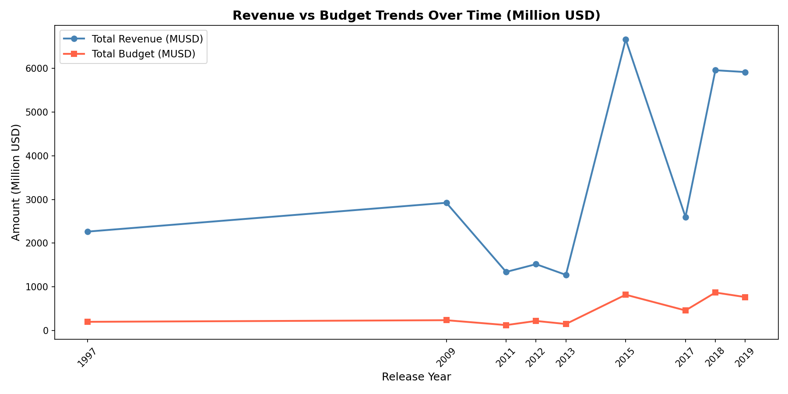
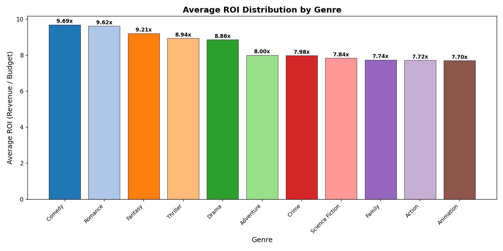
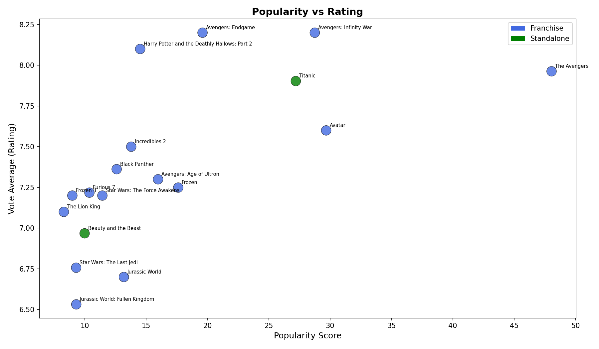
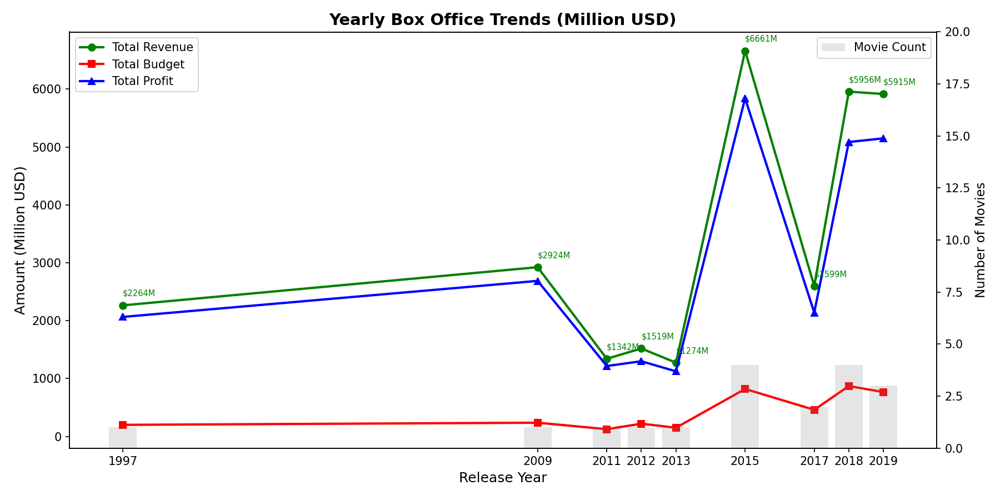
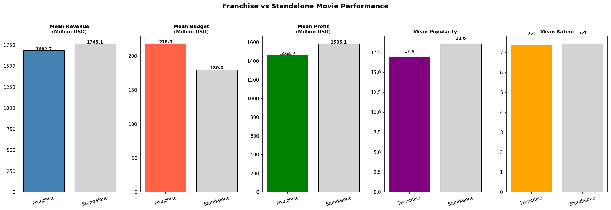

# 🎬 TMDB Movie Data Analysis

A complete end-to-end data engineering pipeline that fetches movie data from the TMDB API, cleans and transforms the dataset, implements key performance indicators (KPIs), and presents findings through visualizations.

---

## 📋 Project Overview

This project was built as part of the AmaliTech Data Engineering Apprenticeship Programme.
It challenges me to independently design and build a complete movie data analysis pipeline
using Python and Pandas.
Starting from raw API data, I fetch movie information from the TMDB API, clean and transform the dataset,
implement key performance indicators (KPIs), and present findings through meaningful visualizations. 
Every step of the workflow from data extraction to final insights was designed and implemented independently, 
reflecting real-world data engineering practices used by international clients.

---

## 🎯 Project Objectives

- **API Data Extraction:** Fetch movie data from the TMDB API
- **Data Cleaning & Transformation:** Process and structure raw data for analysis
- **Exploratory Data Analysis:** Explore trends and patterns in the dataset
- **KPI Implementation:** Identify best and worst performing movies
- **Franchise & Director Analysis:** Assess performance over time
- **Visualization & Insights:** Present key findings using charts

---

## 🗂️ Project Structure

```
TMDB_Analysis/
├── data/
│   ├── raw_movie_data.csv          ← raw data from TMDB API
│   ├── clean_movie_data.csv        ← cleaned and structured data
│   ├── final_clean_movie_data.csv  ← data with cast and crew
│   └── analysis_movies.csv        ← data with KPI columns
├── tests/
│   ├── __init__.py
│   ├── create_test_data.py         ← generates test data file
│   ├── test_data.csv               ← small sample for testing
│   └── test_movies.py              ← unit test cases
├── .env                            ← API key (not pushed to GitHub)
├── .gitignore                      ← files excluded from GitHub
├── fetch_data.py                   ← Step 1: fetch movies from API
├── clean_data.py                   ← Step 2: clean and transform data
├── fetch_credits.py                ← Step 3: fetch cast and crew
├── analysis.py                     ← Step 4: KPI analysis
├── visualize.py                    ← Step 5: data visualization
└── README.md                       ← project documentation
```

---

## 🔄 Pipeline Steps

### Step 1: Fetch Movie Data (`fetch_data.py`)
- Connects to the TMDB API using a personal API key
- Fetches data for 18 movies using specific movie IDs
- Saves raw data to `data/raw_movie_data.csv`

### Step 2: Clean & Transform Data (`clean_data.py`)
- Drops irrelevant columns
- Parses and extracts nested JSON columns (genres, cast, crew)
- Fixes data types (datetime, numeric)
- Replaces unrealistic values (zeros → NaN)
- Converts budget and revenue to Million USD
- Removes duplicates and incomplete rows
- Saves cleaned data to `data/clean_movie_data.csv`

### Step 3: Fetch Cast & Crew (`fetch_credits.py`)
- Fetches cast and crew data from TMDB credits endpoint
- Extracts top 10 cast members and director per movie
- Updates cleaned data with cast and crew information
- Saves to `data/final_clean_movie_data.csv`

### Step 4: KPI Analysis (`analysis.py`)
- Calculates profit (Revenue - Budget)
- Calculates ROI (Revenue / Budget)
- Ranks movies by 10 different KPIs
- Compares franchise vs standalone performance
- Analyzes most successful franchises and directors
- Saves results to `data/analysis_movies.csv`

### Step 5: Visualization (`visualize.py`)
- Revenue vs Budget Trends
- ROI Distribution by Genre
- Popularity vs Rating
- Yearly Box Office Trends
- Franchise vs Standalone Comparison

---

## 📊 Key Insights

### Top Performing Movies
| Movie | Revenue | Budget | ROI |
|---|---|---|---|
| Avatar | $2,923M | $237M | 12.3x |
| Avengers: Endgame | $2,799M | $356M | 7.9x |
| Titanic | $2,264M | $200M | 11.3x |

### Franchise vs Standalone
| Type | Mean Revenue | Mean ROI | Mean Rating |
|---|---|---|---|
| Franchise | $1,682M | 7.79x | 7.39 |
| Standalone | $1,765M | 9.62x | 7.44 |

### Most Successful Director
| Director | Movies | Total Revenue |
|---|---|---|
| James Cameron | 2 | $5,187M |
| Joss Whedon | 2 | $2,924M |

---

## 🛠️ Tools & Technologies

| Tool | Purpose |
|---|---|
| Python | Main programming language |
| Pandas | Data manipulation and analysis |
| Matplotlib | Data visualization |
| NumPy | Numerical operations |
| Requests | API calls |
| python-dotenv | Environment variable management |
| pytest | Unit testing |
| Git | Version control |

---

## ⚙️ How to Run

### 1. Clone the repository
```bash
git clone https://github.com/Odile-nza/Amalitech_Apprenticeship.git
cd TMDB_Analysis
```

### 2. Install dependencies
```bash
pip install requests pandas matplotlib numpy python-dotenv pytest
```

### 3. Create `.env` file with your TMDB API key
```
TMDB_API_KEY=your_api_key_here
```

### 4. Run files in order
```bash
python fetch_data.py
python clean_data.py
python fetch_credits.py
python analysis.py
python visualize.py
```

### 5. Run tests
```bash
pytest tests/test_movies.py -v
```

---

## 📁 Data Source

- **API**: [TMDB (The Movie Database)](https://www.themoviedb.org/)
- **Endpoint**: `https://api.themoviedb.org/3/movie/{movie_id}`
- **Movies**: 18 top grossing movies

---

## 📈 Visualizations & Insights

### Visualization 1: Revenue vs Budget Trends Over Time


> Revenue consistently stays above budget across all years confirming every movie in our dataset was profitable.
> The biggest peak was in 2015 with $6,661M total revenue driven by multiple blockbuster releases. There is a noticeable dip in 2011-2013 
> followed by a strong recoverysuggesting the movie industry experiences cycles of high and low performance.

---

### Visualization 2: ROI Distribution by Genre


> Comedy and Romance genres deliver the highest ROI at 9.69x and 9.62x respectively
> meaning they earn nearly 10 times their budget back. This is likely because these genres typically have lower production budgets.
> Action and Animation despite being the most common genres in blockbusters deliver the lowest ROI at 7.72x and 7.70x due to their very high production costs.

---

### Visualization 3: Popularity vs Rating


> There is no strong correlation between popularity and rating.
> The Avengers is the most popular movie but not the highest rated. 
> Avengers: Infinity War and Endgame have the highest ratings but moderate popularity scores. 
> This suggests audiences engage with movies for different reasons 
> entertainment value versus cinematic quality. 
> Standalone movies (green) are fewer but show mixed performance.

---

### Visualization 4: Yearly Box Office Trends


> Box office performance peaked in 2015 with $6,661M total revenue driven by 
> 4 major releases. The gap between the green line (revenue) and red line (budget) 
> represents total profit, this gap widens over time suggesting movies are becoming more profitable.
> The blue profit line closely follows revenue confirming budgets remain relatively small compared to earnings.

---

### Visualization 5: Franchise vs Standalone Performance


> Standalone movies slightly outperform franchise movies across all KPIs, 
> higher mean revenue ($1,765M vs $1,682M), higher mean profit ($1,585M vs $1,464M) and higher mean popularity (18.6 vs 17.0).
> However this result is misleading because our dataset only contains 2 standalone movies both exceptional blockbusters (Titanic and Beauty and the Beast). 
> A larger dataset would likely show franchise movies outperforming standalone movies.

---

## 🏁 Conclusion

> This analysis of 18 top-grossing movies reveals several key findings. 
> All movies in the dataset were financially successful with every movie earning significantly more than its budget. 
> Comedy and Romance genres deliver the best return on investment despite being less common in blockbuster releases. 
> Popularity does not always correlate with ratings, audiences value entertainment and cinematic quality differently. 
> Box office performance peaked in 2015 and has remained consistently high since. While our small dataset shows standalone movies slightly outperforming franchises, 
> a larger dataset would be needed to draw definitive conclusions. This pipeline demonstrates how data engineering can transform raw API data into actionable business insights.

---

## 👩‍💻 Author

**Odile-**  AmaliTech Data Engineering Apprentice